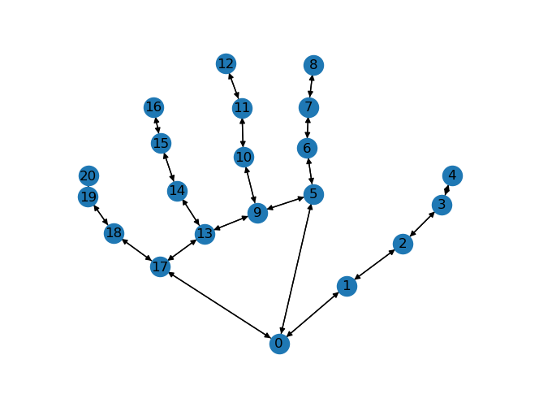

# Shuwa (Sign Language Detection)
Pipeline of sign language detection using YOLO models and classification using GNN, forests, etc.

## Analysis
Check `visualize.ipynb` for graph representation.

Choose on any of the `test.ipynb` file for running the respective models with live translation.

`collection.ipynb` for collecting new landmarks for dataset